# 🚀 Highly Available Three-Tier Online Examination Platform on AWS

A production-style **Online Examination Platform** deployed on AWS using a **Highly Available Three-Tier Architecture**.

This project demonstrates the deployment of a Flask web application across multiple Availability Zones using **Amazon EC2, Application Load Balancer, Auto Scaling Group, and Amazon RDS**, ensuring scalability, high availability, and fault tolerance.

---

# 📌 Project Overview

The Online Examination Platform allows students to:

- Register for an online examination
- Attend an AWS Cloud mock examination
- Submit answers securely through the web application
- View examination results instantly
- Allow administrators to monitor registered students and examination results

The application follows AWS best practices by separating the presentation, application, and database layers into a highly available three-tier architecture.

---

# 🏗️ Architecture Diagram

  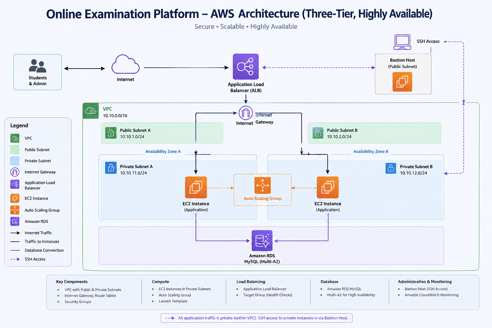

---

# ☁️ AWS Services Used

| AWS Service | Purpose |
|-------------|---------|
| Amazon VPC | Custom Virtual Private Cloud |
| Public & Private Subnets | Network Segmentation |
| Internet Gateway | Public Internet Access |
| NAT Gateway | Internet Access for Private Subnets |
| Bastion Host | Secure SSH Access |
| Amazon EC2 | Flask Application Servers |
| Application Load Balancer | Traffic Distribution |
| Auto Scaling Group | High Availability & Auto Recovery |
| Amazon RDS (MySQL) | Relational Database |
| Security Groups | Instance Security |
| Amazon CloudWatch | Monitoring |
| CloudWatch Alarm | Health Monitoring |

---

# ⭐ Features

- Student Registration
- AWS Cloud Mock Examination
- Automatic Score Evaluation
- Instant Result Generation
- Administrator Dashboard
- Highly Available Three-Tier Architecture
- Application Load Balancer
- Auto Scaling Group
- Amazon RDS Integration
- Multi-AZ Deployment
- CloudWatch Monitoring
- CloudWatch Alarm Configuration

---

# 🏛️ Architecture Components

- Custom VPC
- 2 Public Subnets
- 2 Private Application Subnets
- 2 Private Database Subnets
- Internet Gateway
- NAT Gateway
- Bastion Host
- Application Load Balancer
- Auto Scaling Group
- Amazon EC2 Instances
- Amazon RDS MySQL Database
- CloudWatch Dashboard
- CloudWatch Alarm

---

# 📁 Project Folder Structure

  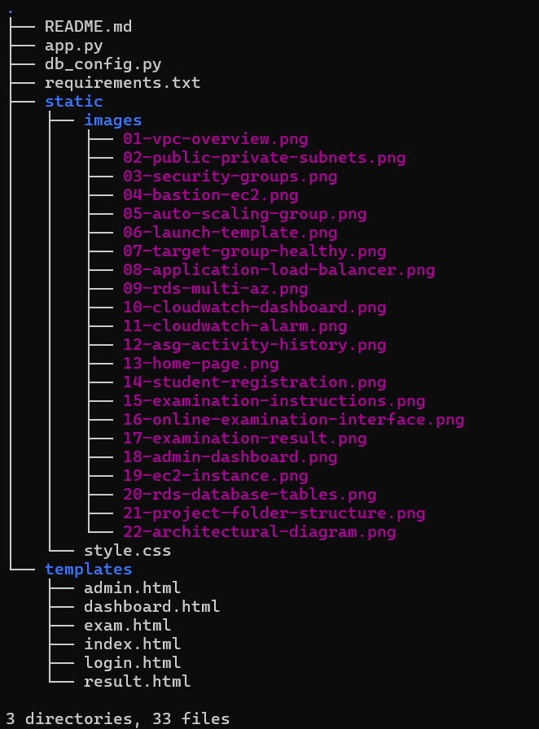

---

# 🚀 Deployment Workflow

1. Create a Custom VPC
2. Configure Public and Private Subnets
3. Create Route Tables
4. Configure Internet Gateway and NAT Gateway
5. Create Security Groups
6. Launch Bastion Host
7. Launch Private EC2 Application Instances
8. Configure Amazon RDS MySQL Database
9. Deploy Flask Application
10. Configure Python Virtual Environment
11. Install Application Dependencies
12. Configure Gunicorn Service
13. Create Launch Template
14. Configure Auto Scaling Group
15. Configure Application Load Balancer
16. Register EC2 Instances with Target Group
17. Configure CloudWatch Dashboard
18. Configure CloudWatch Alarm
19. Validate High Availability Architecture

---

# 📸 Project Screenshots

## 1. VPC Overview

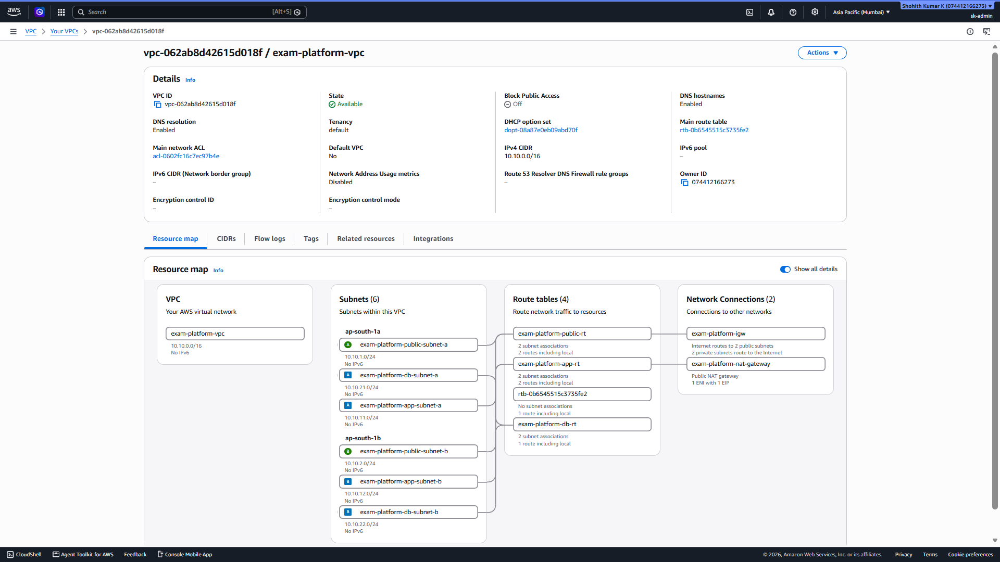

---

## 2. Public & Private Subnets

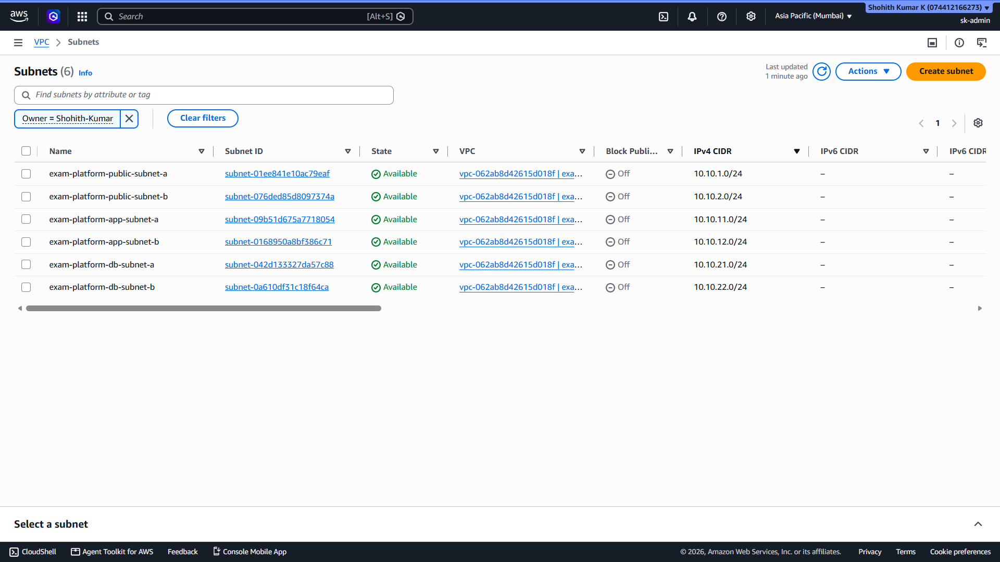

---

## 3. Security Groups

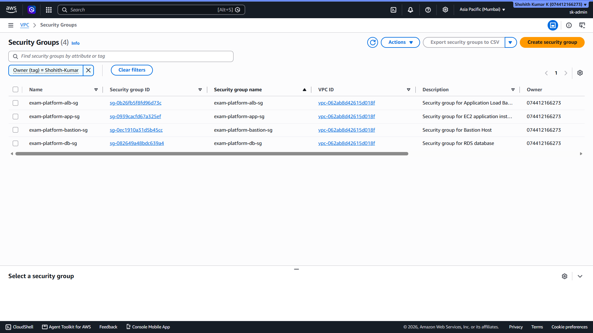

---

## 4. Bastion Host EC2 Instance

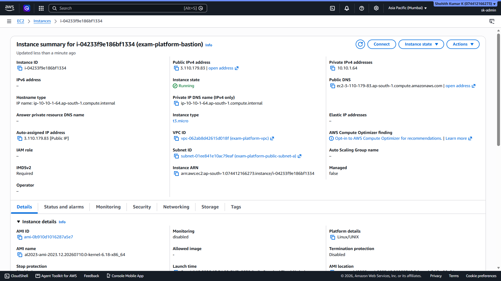

---

## 5. Auto Scaling Group

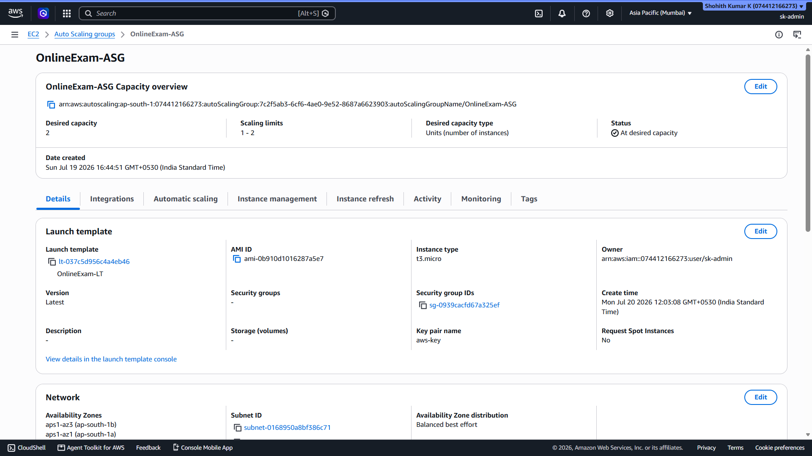

---

## 6. Launch Template

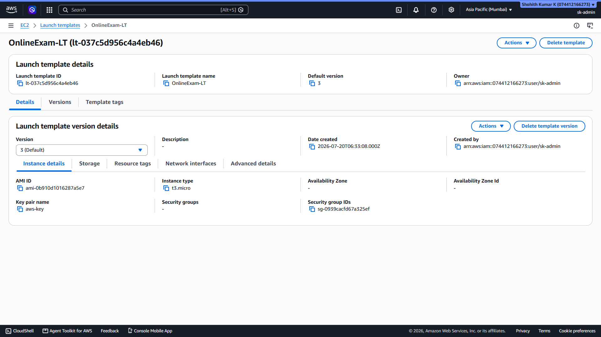

---

## 7. Target Group

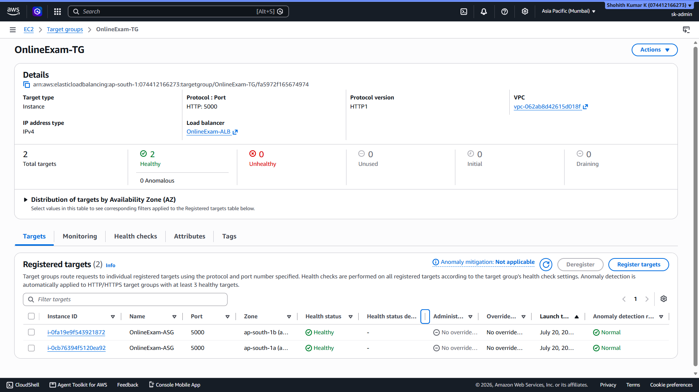

---

## 8. Application Load Balancer

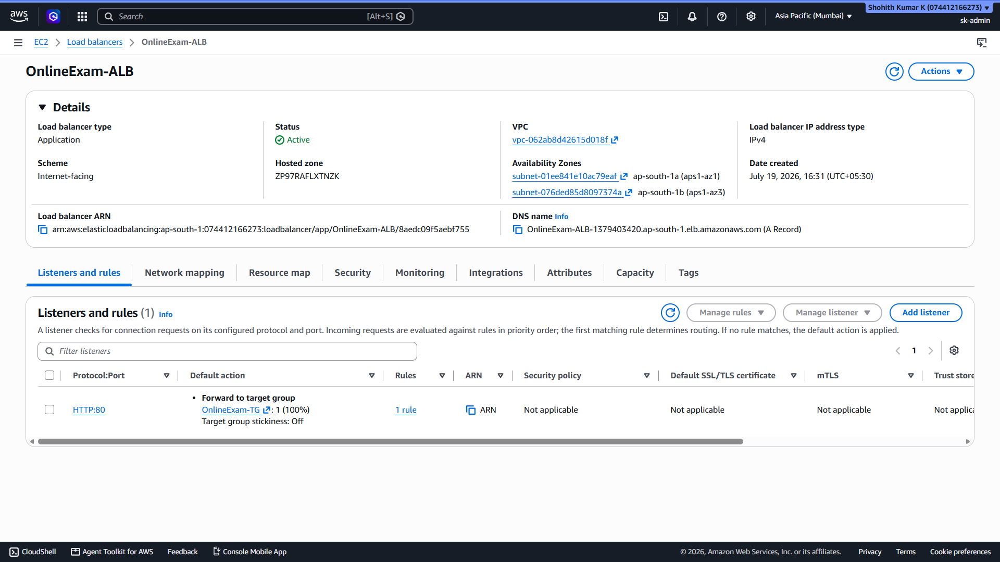

---

## 9. Amazon RDS (MySQL)

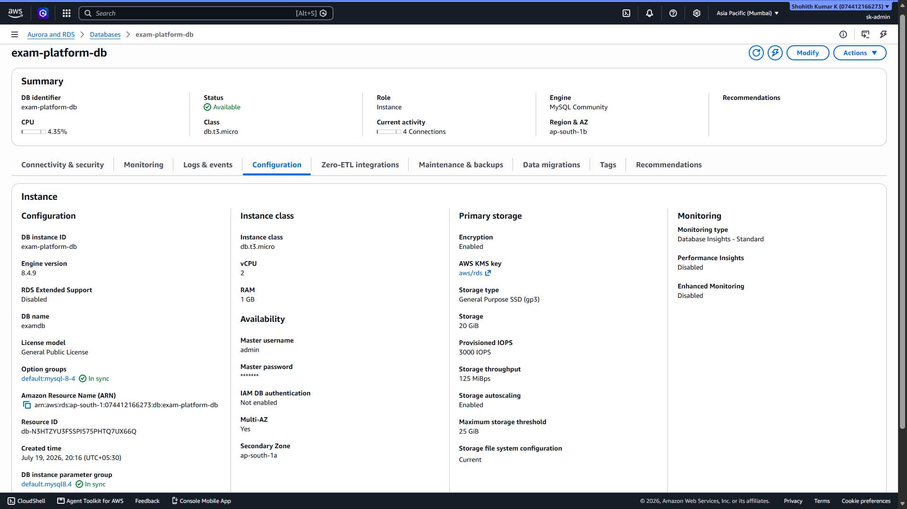

---

## 10. CloudWatch Dashboard

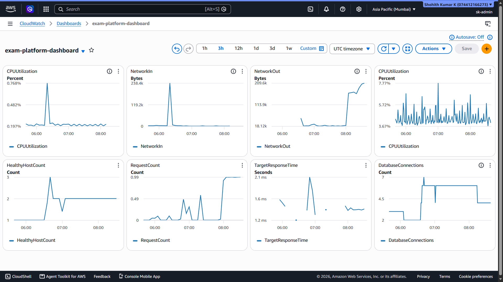

---

## 11. CloudWatch Alarm

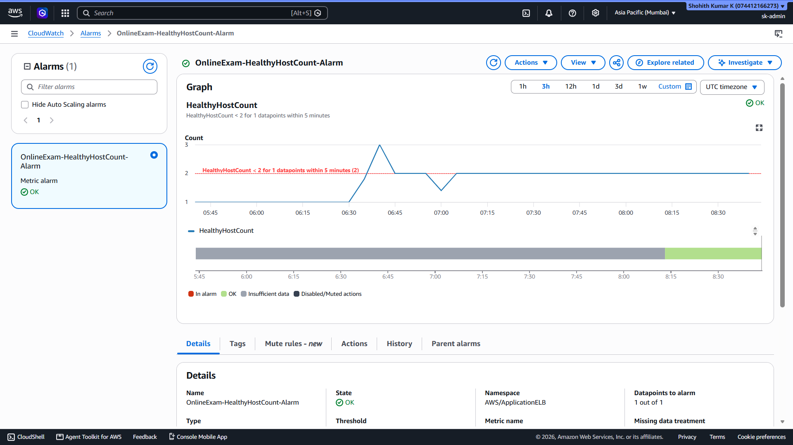

---

## 12. Auto Scaling Activity History

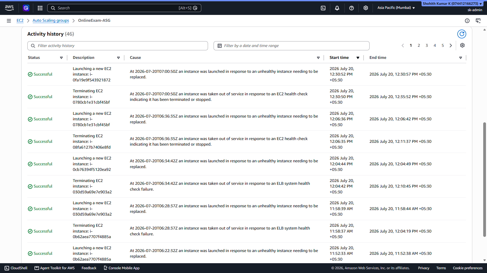

---

## 13. Application Home Page

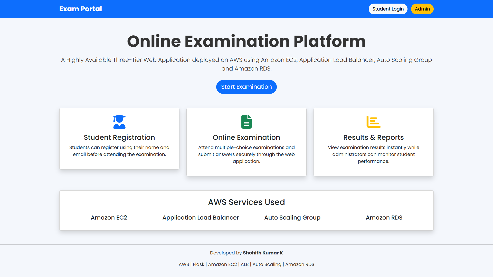

---

## 14. Student Registration

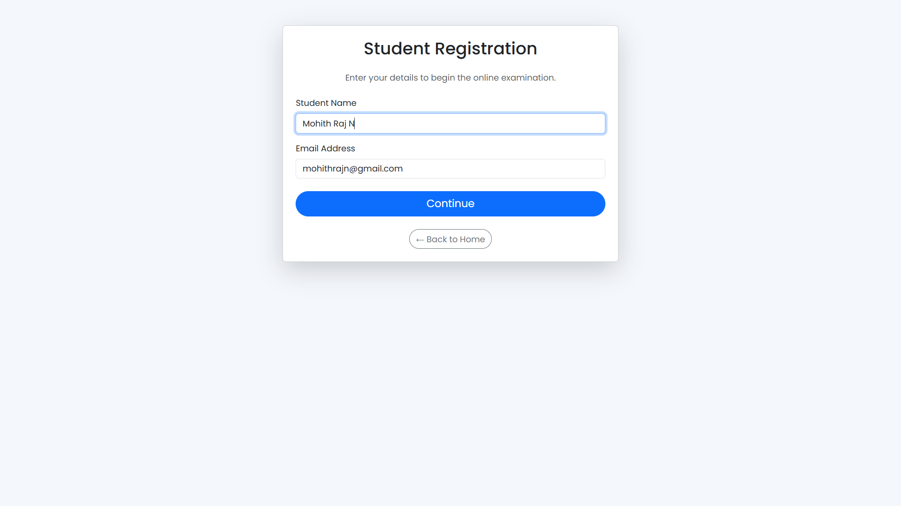

---

## 15. Examination Dashboard

---

## 16. Online Examination

---

## 17. Examination Result

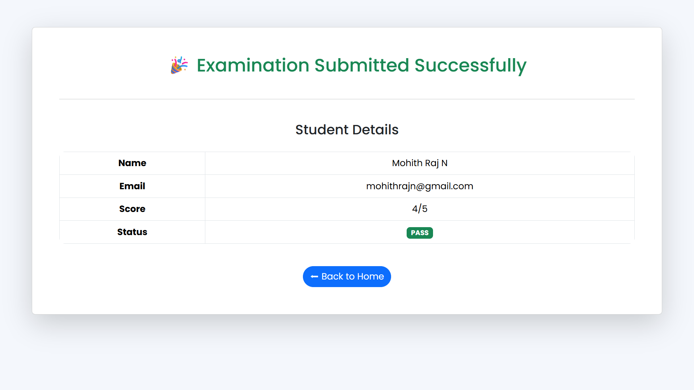

---

## 18. Administrator Dashboard

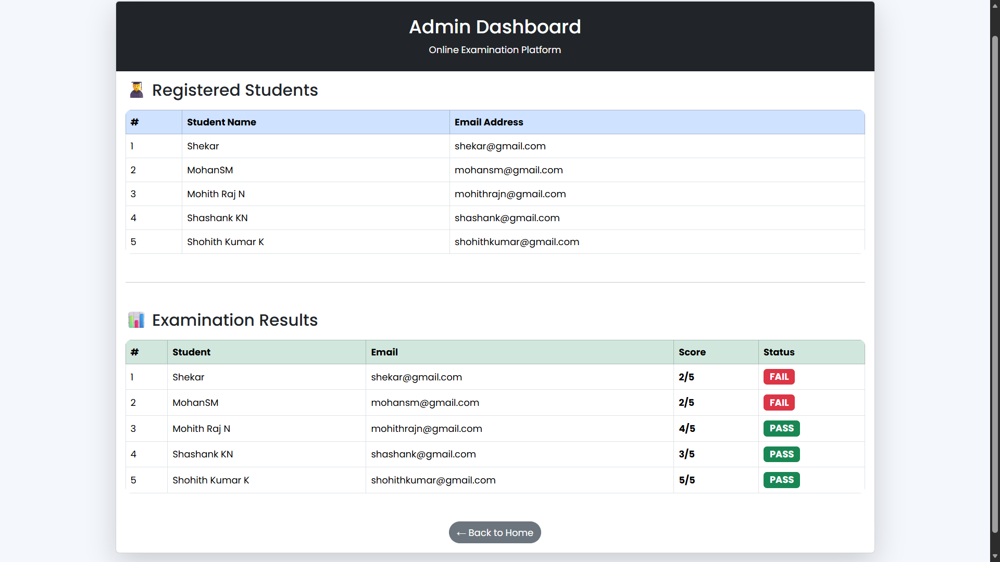

---

# 👨‍💻 Author

**Shohith Kumar K**

Cloud & DevOps Enthusiast

- **GitHub:** https://github.com/shohith-git
- **LinkedIn:** https://www.linkedin.com/in/shohith-kumar-k-3875a2300

---

## ⭐ If you found this project useful, consider giving it a star on GitHub!
